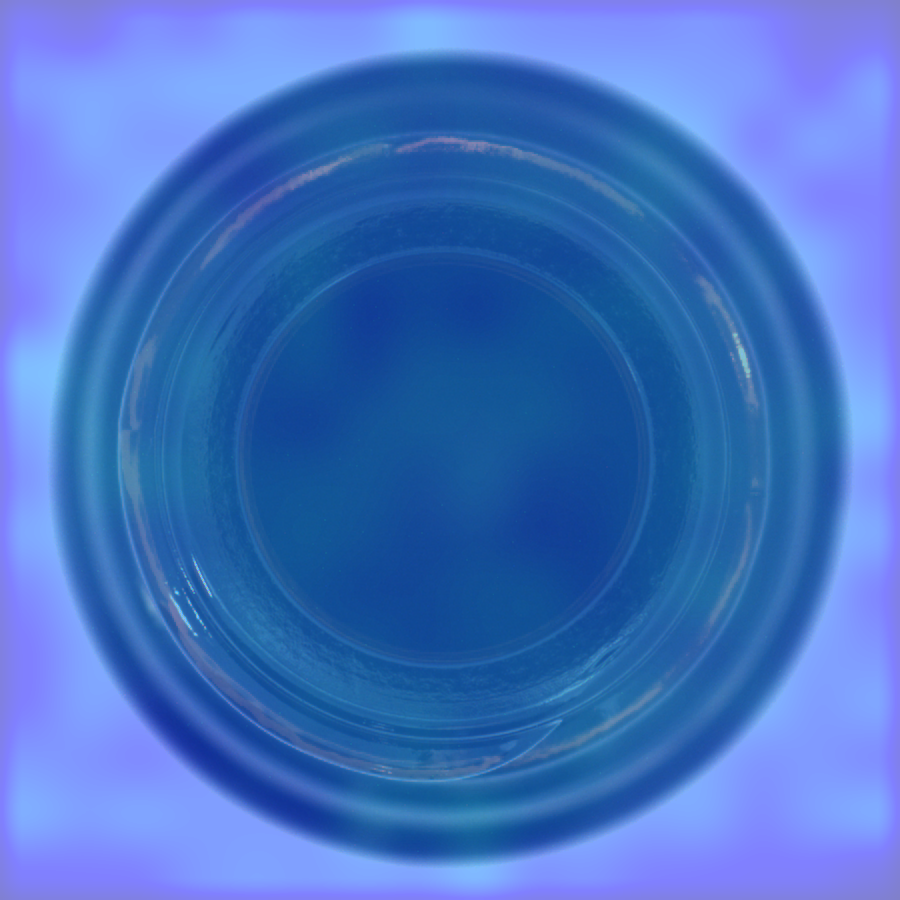
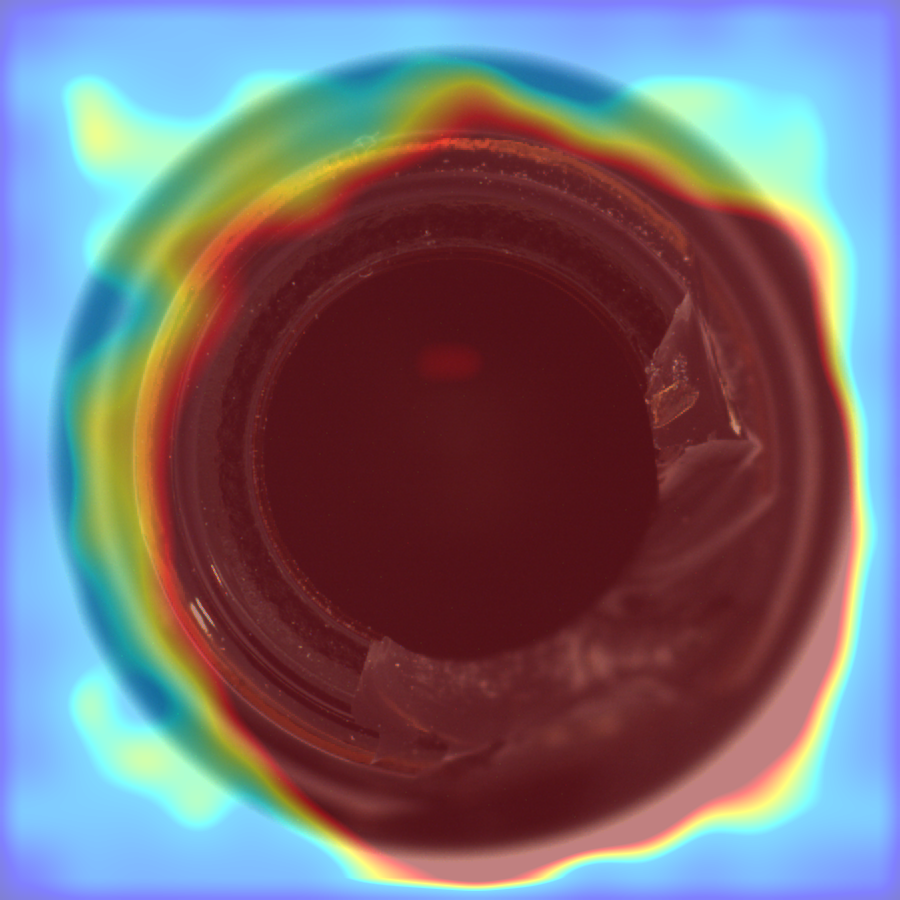
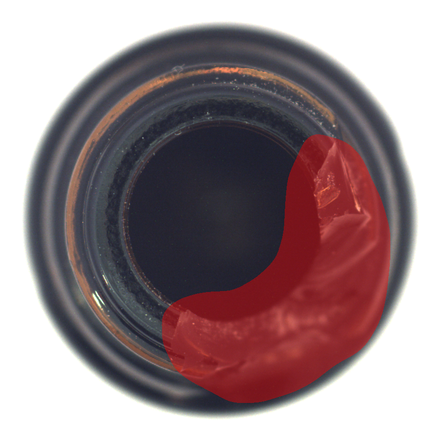
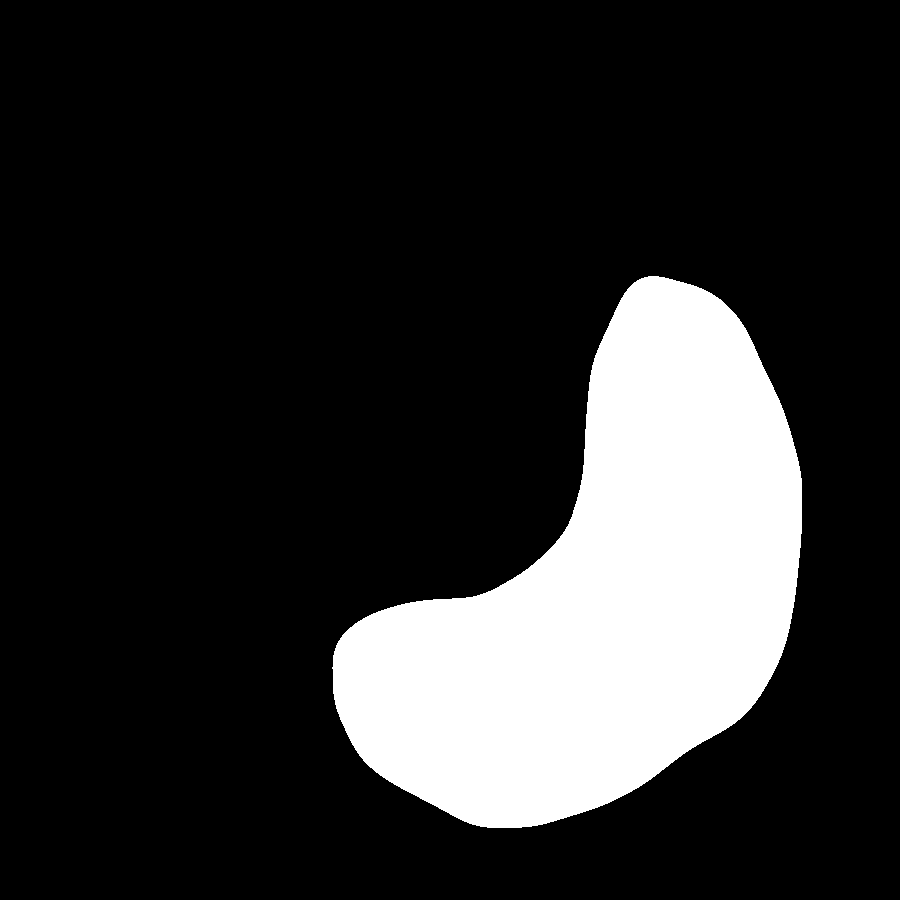
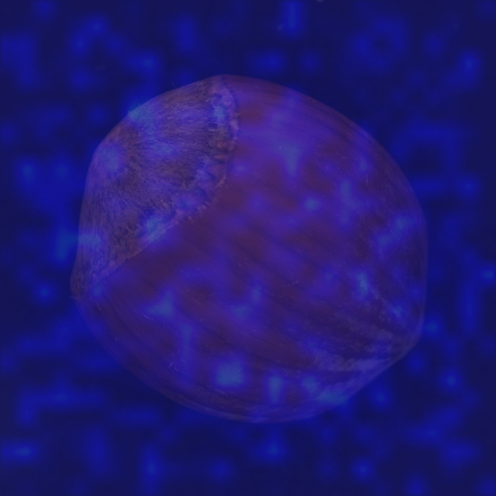
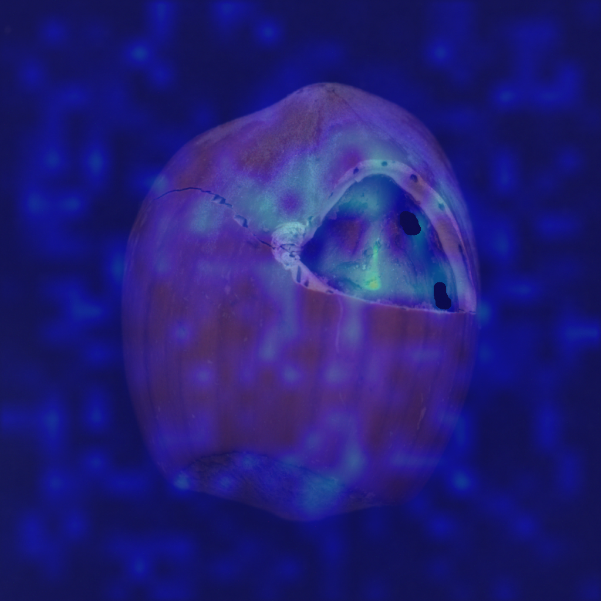
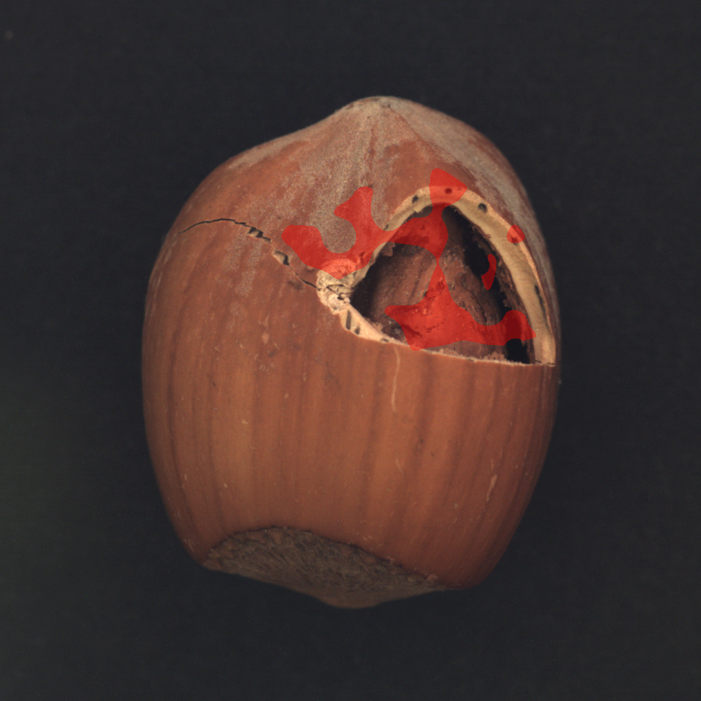
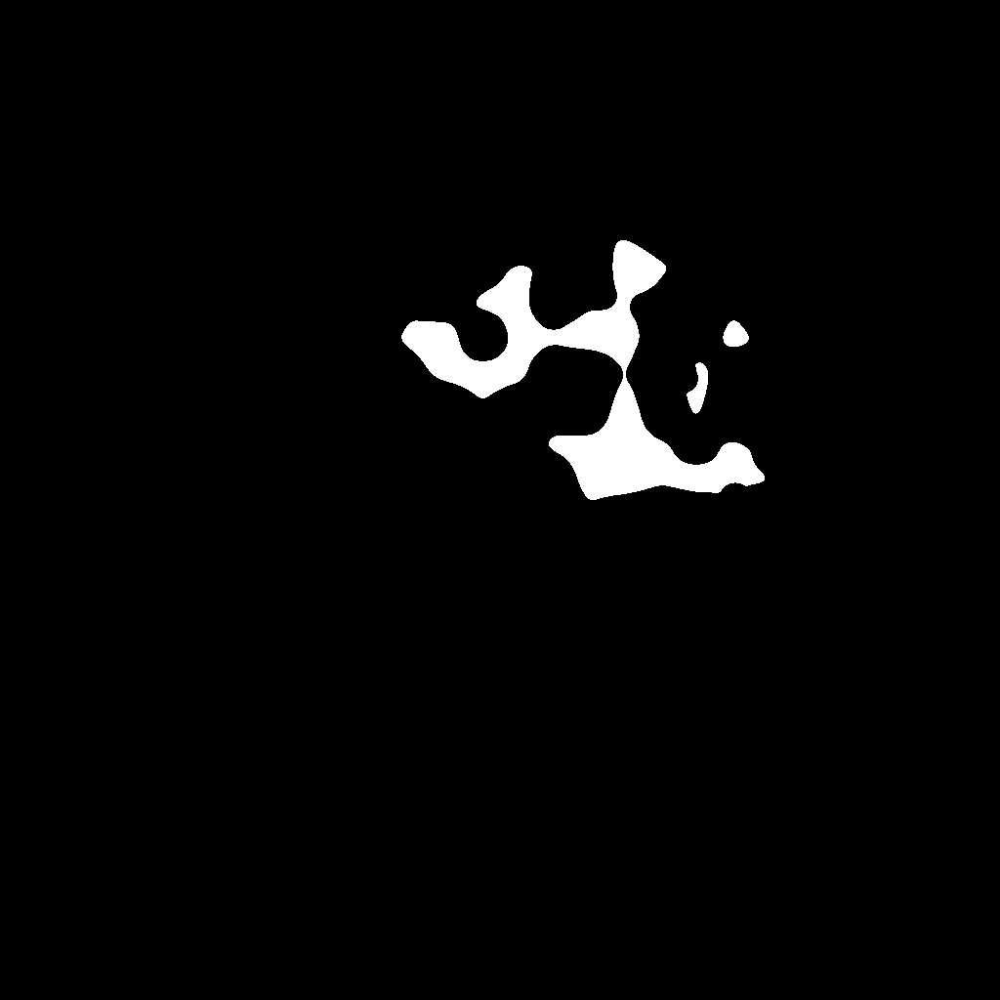
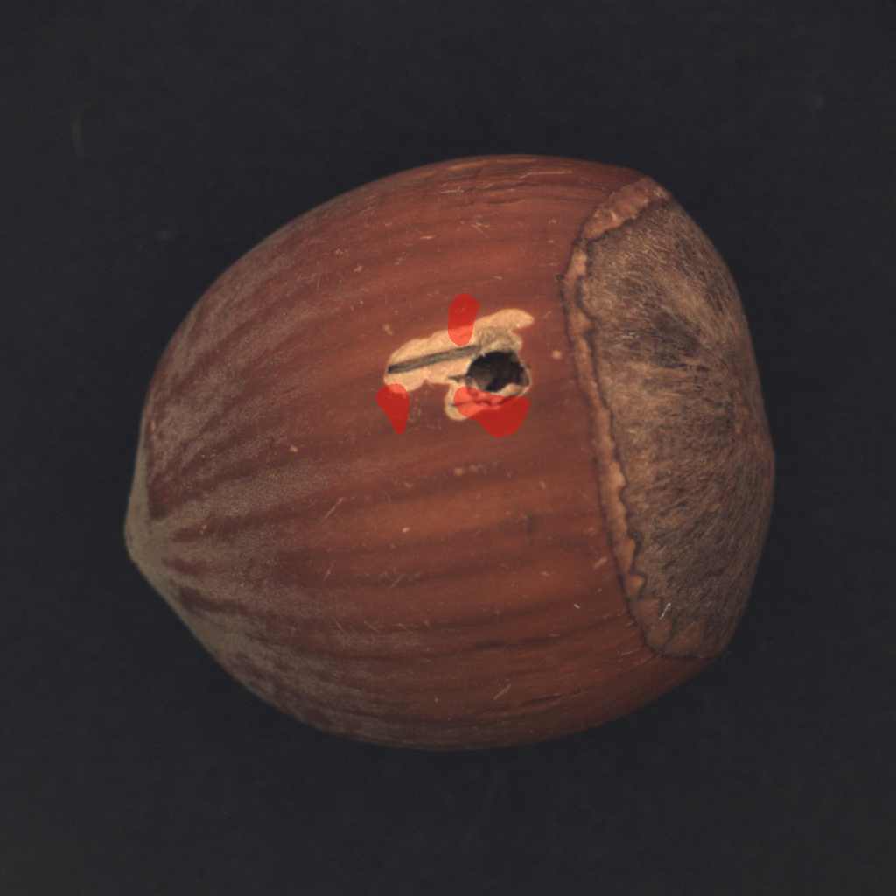
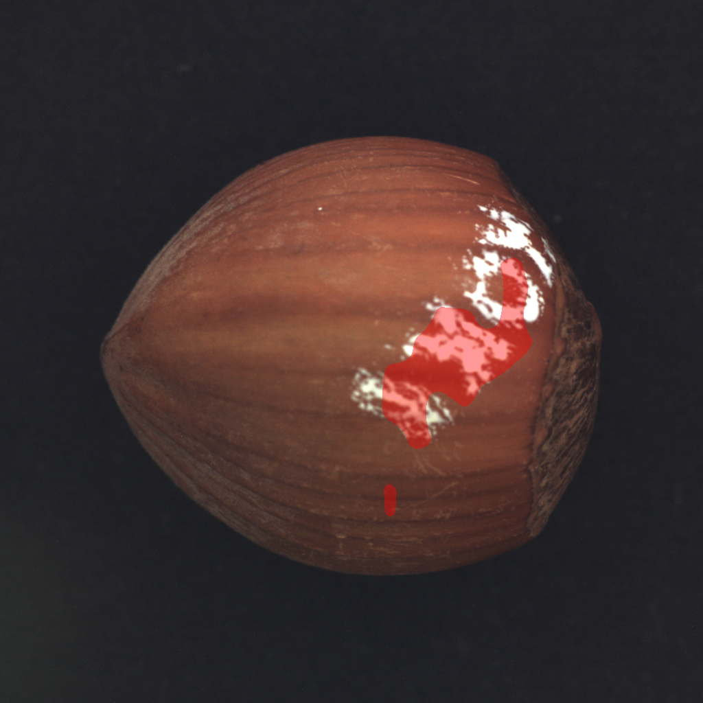

# AnomalyDet

Memory-bank-based unsupervised anomaly detection for rotation-capture
inspection of cylindrical automotive parts. Built on PatchCore
(Roth et al., CVPR 2022). Trains on a normal-only image set and produces,
for every input image, a defect heatmap, a binary mask, and a
LabelMe-compatible JSON of polygon annotations.

## Sample outputs (DINOv2 ViT-S/14)

Heatmap colour is anchored to the training-set ceiling — blue means
"more normal than anything seen during training", red means clearly
above. Defect mask is the binary output that gets serialised to JSON.

### bottle (no augmentation, threshold_mode=adaptive)

| Input class | Heatmap overlay | Mask overlay | Binary mask |
|---|---|---|---|
| good (normal) |  | _empty mask_ | _empty mask_ |
| broken_large (defect) |  |  |  |

### hazelnut (DINOv2 ViT-L/14 + rotation+flip+colour aug + reweight K=9, threshold_value=30)

| Input class | Heatmap overlay | Mask overlay | Binary mask |
|---|---|---|---|
| good (normal) |  | _empty mask_ | _empty mask_ |
| crack (defect) |  |  |  |
| hole (defect) | — |  | — |
| print (defect) | — |  | — |

## Why this exists

Rule-based pre-filtering misses defect categories the rules were not
written for, and labelling effort is dominated by humans eyeballing
candidates against goldens. This pipeline runs a recall-first second
stage: large normal set + zero-to-few defects, output a sortable score
plus pixel-level localization that can be relabelled and fed back into a
supervised loop later.

## Method

- Backbone (config-selectable, see [Backbones](#backbones)):
  - **WideResNet-50** (ImageNet), `layer2 + layer3` mid-block features.
  - **DINOv2 ViT-S/14** (Meta), transformer blocks 5 + 11 reshaped to
    spatial maps.
- Local neighbourhood aggregation: 3x3 average pooling, stride 1.
- Memory bank: every training patch embedding stacked, then k-center
  greedy coreset subsampling (default 10%) so inference is a single
  nearest-neighbour pass against tens of thousands of vectors.
- Anomaly map: per-patch nearest-neighbour distance, bilinearly
  upsampled to input resolution, smoothed with an 11x11 Gaussian.
- Optional pose augmentation at memory-bank build (rotation + flips)
  for parts whose canonical pose isn't fixed (hazelnut, screw, etc.).
  See [Pose augmentation](#pose-augmentation).
- Threshold calibration: pixel-score percentile of the training set
  (all-normal) recorded in the memory bank file, **measured on the
  un-augmented training data** so it reflects real-image baseline.
  Inference picks one of five strategies (see [Threshold strategies](#threshold-strategies)).
- Heatmap visualization: anchored to `train_pixel_max` so blue ≡
  "definitely normal" and red ≡ "above training ceiling" — the same
  scale across every image, no per-image min-max stretch.
- Postprocess: morphological open+close, area filter, contour
  extraction, polygon simplification, write LabelMe JSON.

## Backbones

A single feature-extractor factory ([src/models/feature_extractor.py](src/models/feature_extractor.py))
dispatches on backbone name. To switch backbones, swap the config:

```yaml
# configs/default.yaml — ResNet family
backbone: wide_resnet50_2     # or resnet50, resnet18
layers: [layer2, layer3]      # named ResNet stages
```

```yaml
# configs/dinov2.yaml — DINOv2 family
backbone: dinov2_vits14       # or dinov2_vitb14, dinov2_vitl14, dinov2_vitg14
layers: [5, 11]               # transformer block indices
input_size: 224               # must be divisible by patch_size (14)
```

The PatchCore code itself is backbone-agnostic — the factory returns a
module whose `forward()` yields `{layer_name: (B, D, H, W)}` regardless
of architecture.

## Threshold strategies

Set with `threshold_mode` in the YAML or `--threshold-mode` on the CLI.

| Mode | What it does | When to use |
|---|---|---|
| `adaptive` (default) | Per-image gate (skip if `image_score < train_image_max * image_gate_factor`) + Otsu/severity/floor max | Recall-first with tight masks; works when good vs defect image-score gap is wide |
| `train_max` | Global: any pixel above the worst training pixel | Catches every anomaly; bleeds into normal regions |
| `train_p999` / `train_p99` | Global: percentile of training-set pixel scores | Stricter than `train_max` but still calibration-driven |
| `test_percentile` | Legacy: percentile across all test pixels | Backwards compat only |
| `--threshold <float>` | Hard-coded value | When you have a validated number |

Adaptive knobs (CLI flags or YAML):
- `image_gate_factor` (default 1.3) — multiplier on `train_image_max` for the gate
- `severity_fraction` (default 0.5) — threshold floor at `image_score * fraction`
- `pixel_floor_factor` (default 1.1) — hard floor at `train_pixel_max * factor`

> **When to pick which.** With pose augmentation (hazelnut etc.), the
> memory bank covers more of the score range, which closes the gap
> between good and defective image scores; the adaptive image gate then
> ends up suppressing real defects too. Use `train_p999` for those
> categories. For fixed-pose parts (bottle), `adaptive` works.

## Pose augmentation

Some categories (hazelnut, screw, ...) ship with natural rotation and
position variation in test images that the train split underrepresents.
Without intervention, the memory bank's `train_pixel_max` ends up below
the test-set "good" floor, the gate fires on every test image, and the
mask explodes.

The fix is rotation + flip augmentation while building the bank.
Configurable per-category:

```yaml
# configs/hazelnut.yaml — augmentation enabled
train_augment: true
train_repeat: 4              # see each image 4x under different rotations
threshold_mode: train_p999   # adaptive's image gate over-fires after aug
```

Or override from the CLI without editing config:

```powershell
python -m src.train --config configs/default.yaml `
    --data-root "E:\dataset\mvtec_anomaly_detection_" --category hazelnut `
    --augment --repeat 4
```

The fit pass uses the augmented loader; the calibration pass uses the
original images so the threshold floor stays interpretable.

## Repo layout

```
configs/
  default.yaml                 WideResNet baseline (fixed-pose categories)
  dinov2.yaml                  DINOv2 ViT-S/14 baseline
  hazelnut.yaml                WideResNet + rotation aug + train_p999 threshold
  hazelnut_dinov2.yaml         DINOv2 ViT-S + rotation aug + train_p999
  hazelnut_dinov2b.yaml        DINOv2 ViT-B/14 + 392 input + reweight + tuned threshold
  hazelnut_dinov2l.yaml        DINOv2 ViT-L/14 + 392 input + reweight + tuned threshold (best)
docs/samples/                  example heatmap / mask / overlay shown above
src/data/                      MVTec dataset (with `repeat` for aug) + transforms
src/models/feature_extractor   factory: ResNet hooks vs DINOv2 intermediate layers
src/models/patchcore           memory bank build / score / calibration
src/utils/coreset              k-center greedy with random projection
src/utils/postprocess          heatmap -> mask -> LabelMe JSON; adaptive threshold
src/utils/visualize            calibrated heatmap normalize + mask overlays
src/train.py                   memory-bank build (augmented) + calibration (original)
src/inference.py               produce mask + JSON for a folder or MVTec test split
scripts/smoke_check.py         synthetic-data sanity test (no MVTec needed)
scripts/run_demo.ps1           end-to-end demo on MVTec bottle
scripts/download_mvtec.py      download a single MVTec category
scripts/sweep_thresholds.py    run inference under 8 threshold configs and summarize
scripts/compare_runs.py        side-by-side markdown comparison of multiple sweeps
tests/test_smoke.py            pytest covering pipeline + postprocess
```

## Setup

```powershell
conda env create -f environment.yml
conda activate anomalydet
python scripts/smoke_check.py
```

The smoke check runs train + inference on synthetic images and
confirms torch + CUDA + the full pipeline are wired up.

## Train + inference

```powershell
# train: build the memory bank from train/good (WideResNet)
python -m src.train `
    --config configs/default.yaml `
    --data-root "E:\dataset\mvtec_anomaly_detection_" `
    --category bottle

# train with DINOv2 instead — just a different config file
python -m src.train `
    --config configs/dinov2.yaml `
    --data-root "E:\dataset\mvtec_anomaly_detection_" `
    --category bottle `
    --output outputs/bottle_dinov2

# train with rotation augmentation (hazelnut etc.)
python -m src.train `
    --config configs/hazelnut_dinov2.yaml `
    --data-root "E:\dataset\mvtec_anomaly_detection_" `
    --category hazelnut `
    --output outputs/hazelnut_dinov2_aug

# inference: MVTec test split
python -m src.inference `
    --config configs/default.yaml `
    --data-root "E:\dataset\mvtec_anomaly_detection_" `
    --category bottle `
    --memory-bank outputs/bottle/memory_bank.pt

# inference: arbitrary folder of new images
python -m src.inference `
    --memory-bank outputs/bottle/memory_bank.pt `
    --input-dir path\to\new\images `
    --output outputs\custom_run

# inference: override adaptive knobs without editing YAML
python -m src.inference `
    --config configs/dinov2.yaml `
    --memory-bank outputs/bottle_dinov2/memory_bank.pt `
    --data-root "E:\dataset\mvtec_anomaly_detection_" --category bottle `
    --image-gate-factor 1.5 --severity-fraction 0.7
```

Per-image artifacts under `outputs/<category>/predictions/`:

```
<defect>_<stem>_heatmap.png        normalized anomaly map
<defect>_<stem>_mask.png           binary defect mask
<defect>_<stem>_overlay_heatmap.png  heatmap blended over original
<defect>_<stem>_overlay_mask.png     mask blended over original
<defect>_<stem>.json               LabelMe shapes + image score + threshold
```

## Threshold sweep

Eight common threshold configs run in one shot, each saved to its own
output directory plus a `summary.csv`:

```powershell
python scripts/sweep_thresholds.py `
    --config configs/default.yaml `
    --data-root "E:\dataset\mvtec_anomaly_detection_" `
    --category bottle `
    --memory-bank outputs/bottle/memory_bank.pt `
    --output-root outputs/bottle/sweep
```

Combine sweeps from multiple `(backbone, category)` runs into one
markdown table:

```powershell
python scripts/compare_runs.py `
    "outputs/bottle/sweep/summary.csv:wrn50_bottle" `
    "outputs/bottle_dinov2/sweep/summary.csv:dinov2_bottle" `
    "outputs/hazelnut/sweep/summary.csv:wrn50_hazelnut" `
    "outputs/hazelnut_dinov2/sweep/summary.csv:dinov2_hazelnut" `
    --out outputs/comparison.md
```

## Validated results

MVTec AD, RTX 3080. Mask coverage as % of image, `gated/n` is how many
test images were short-circuited to an empty mask by the image-level
gate.

### bottle (`adaptive` baseline, `gate=1.3 sev=0.5`)

| Backbone | good gated | broken_large mean | broken_small mean | contamination mean | bank size |
|---|---|---|---|---|---|
| WideResNet-50 | 14/20 | 22.46% | 8.54% | 16.81% | 16385x1536 |
| **DINOv2 ViT-S/14** | **20/20** | **20.71%** | **6.22%** | **11.87%** | **5350x768** |

### hazelnut

Hazelnut needed several coordinated upgrades on top of the bottle stack:

1. **Pose augmentation at build time** (rotation + flips + mild colour
   jitter, repeat=4). Without it, `train_pixel_max` sits below good
   test scores and the image gate fires on every frame.
2. **K-NN softmax reweighting** (`reweight_k=9`) — original PatchCore
   trick that boosts patches sitting in sparse memory-bank regions, so
   the anomaly response sharpens around real defects instead of
   bleeding across surface texture.
3. **Foreground masking** at inference (`foreground_mask: true`) so
   the dark backdrop never contributes anomaly score.
4. **Fragment merging** (`merge_kernel: 31`) so locally-broken defect
   regions read as a single connected blob instead of a scatter.
5. **Bigger backbone + larger input.** Three steps tested:

Mask coverage progression on hazelnut, % of image:

| Setup | good mean | good max | crack | cut | hole | print |
|---|---|---|---|---|---|---|
| ViT-S + aug + `train_p999` | 0.02% | _high_ | 14.31% | 2.84% | 3.96% | 6.69% |
| ViT-B + 224 + reweight + `train_p999` | 0.13% | 1.03% | 7.89% | 1.54% | 2.40% | 3.35% |
| ViT-B + 392 + reweight + `threshold=30` | 0.00% | 0.08% | 3.99% | 0.50% | 1.05% | 1.67% |
| **ViT-L + 392 + reweight + `threshold=30`** | **0.00%** | **0.00%** | **2.16%** | **0.30%** | **0.80%** | **1.02%** |

Final stack (`configs/hazelnut_dinov2l.yaml`): every good frame is
fully clean, masks track the actual defect outlines instead of the
whole hazelnut surface, and surface false-positive blobs that were
the original complaint are gone. Training the ViT-L bank takes ~3-4
min on an RTX 3080 (calibration dominates).

bottle is unchanged — `configs/dinov2.yaml` (un-augmented, `adaptive`
threshold) is still the right baseline because bottles are captured
in a fixed pose with a wide good-vs-defect score gap.

## Branching

`main` holds the validated baseline. Each experiment lives on a branch
off `dev` (e.g. `feat/threshold-calibration`, `exp/dinov2-backbone`)
and only merges back to `main` after validation.

```powershell
git checkout dev
git pull
git checkout -b feat/your-experiment
# ... iterate, commit ...
git push -u origin feat/your-experiment
# open PR: dev <- feat/your-experiment, then dev -> main
```

## License

Internal project. MVTec AD images are subject to MVTec's own license.
DINOv2 weights are released by Meta under their own terms; see
https://github.com/facebookresearch/dinov2.
