# AnomalyDet

Memory-bank-based unsupervised anomaly detection for rotation-capture
inspection of cylindrical automotive parts. Paper-faithful PatchCore
(Roth et al., CVPR 2022) on top of a frozen DINOv2 ViT-S/14 backbone.
Trains on a normal-only image set and produces, for every input image,
a defect heatmap, a binary mask, a 6-panel visualization, and a
LabelMe-compatible JSON of polygon annotations.

## TL;DR

- **Recommended config**: [configs/patchcore_official_dinov2_518.yaml](configs/patchcore_official_dinov2_518.yaml) + `--num-nn 3 --guided-filter`
- **Best result on MVTec hazelnut (vs ground truth)**: F1 = **0.824**, IoU = **0.700**, Precision = **0.789**, Recall = **0.861**
- **Production mode (no GT)**: same config + `--threshold-target train_p999`

```powershell
# train + run inference + produce panels + dump summary, in one shot
python scripts/run_patchcore_official.py `
    --config configs/patchcore_official_dinov2_518.yaml `
    --data-root "E:\dataset\mvtec_anomaly_detection_" `
    --category hazelnut `
    --output outputs/patchcore_k3_gf_hazelnut `
    --num-nn 3 --guided-filter --gf-radius 8 --gf-eps 0.001 `
    --threshold-target iou
```

## Sample outputs

6-panel composite per image: `image | heatmap | mask (pred) | gt | pred conf fg | pred conf bg`.

- `heatmap` — raw anomaly score before thresholding, anchored to the
  run's `train_pixel_max` so blue = below training ceiling and red =
  above it. Same colour scale across every panel.
- `mask (pred)` — binary mask after the chosen threshold. Same binary
  is reused everywhere (overlay PNGs, LabelMe JSON, evaluator).
- `gt` — dataset ground-truth mask (defective images only).
- `pred conf fg` / `pred conf bg` — heatmap restricted to predicted
  defect / non-defect pixels; reads whether the foreground is
  consistently hot and the background consistently cold.

### Hazelnut (DINOv2 ViT-S/14 @ 518 + K=3 NN + Guided filter)

| Input     | Panel |
|---|---|
| good 000  |  |
| crack 000 | 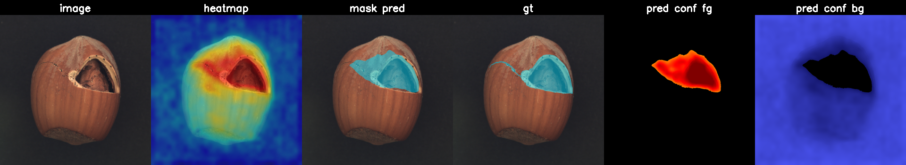 |
| crack 005 | 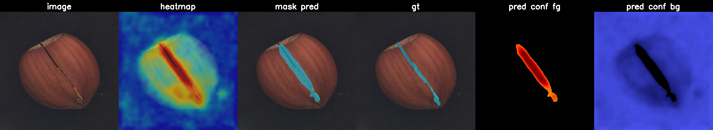 |
| cut 001   | 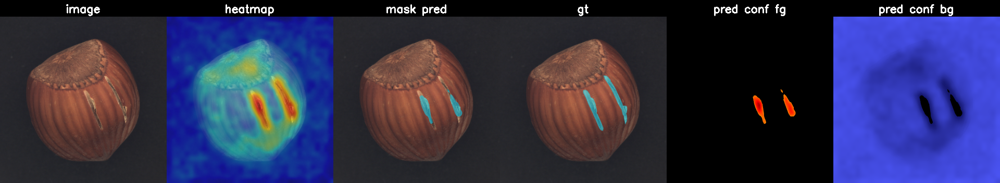 |
| hole 005  | 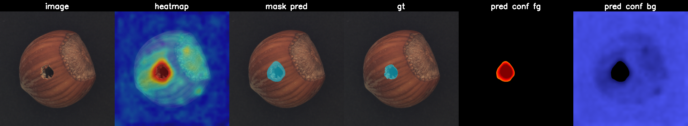 |
| print 005 |  |

## Why this exists

Rule-based pre-filtering misses defect categories the rules were not
written for, and labelling effort is dominated by humans eyeballing
candidates against goldens. This pipeline is a recall-first second
stage: large normal set + zero defect labels, output a sortable image
score plus pixel-level localization that can be relabelled and fed
back into a supervised loop later. Designed for rotation-capture
inspection of cylindrical automotive parts — the part is rotated
under the camera, every frame is fed in unlabelled.

## Method

1. **Backbone** — DINOv2 ViT-S/14 ([Meta release](https://github.com/facebookresearch/dinov2)),
   frozen. Transformer blocks 5 and 11 are extracted as spatial
   feature maps and concatenated.
2. **Patch aggregation** — 3×3 average pool, stride 1, on each layer
   independently, then concatenate along channel dim.
3. **Memory bank build** — every training-image patch embedding stacked
   into a single matrix, then k-center greedy coreset subsampling
   (ratio 0.1 = keep ~10%) with Johnson-Lindenstrauss random
   projection to 128 dims for the greedy step.
4. **Index** — FAISS `IndexFlatL2` over the coreset (CPU is fine).
5. **Score per patch** — average of L2 distances to the **K=3** nearest
   coreset neighbours (`--num-nn 3`). Paper default is K=1; K=3
   smooths against isolated coreset outliers and gives +0.4 pp F1 on
   hazelnut.
6. **Upsample + edge-snap** — bilinear-upsample patch scores to image
   resolution, then **guided filter** with the original RGB
   (grayscale) as guide (`--guided-filter`, He et al. 2010). Snaps
   the score-map gradient to image edges so the predicted mask
   outline tracks defect boundaries instead of spreading 1-2 patch
   widths outward.
7. **Threshold** — sweep across candidate thresholds; pick the one
   that maximises F1 / IoU against GT (development mode), or use the
   99.9th percentile of training-pixel scores when GT is unavailable
   (production mode, `--threshold-target train_p999`).
8. **Postprocess** — optional morph open+close + min-area filter
   (`--apply-clean-mask`, off by default), contour extraction,
   polygon simplification, write LabelMe JSON.

## Setup

```powershell
conda env create -f environment.yml
conda activate anomalydet
python scripts/smoke_check.py     # synthetic-data sanity check
```

The smoke check runs train + inference on synthetic images and
confirms torch + CUDA + the full pipeline are wired up.

## Train + inference

The single runner [scripts/run_patchcore_official.py](scripts/run_patchcore_official.py)
covers fit + inference + GT sweep + panel viz in one pass. The first
invocation per category builds the memory bank; subsequent runs reuse
it via `--memory-bank`.

```powershell
# first run: builds the memory bank, runs inference, sweeps threshold
python scripts/run_patchcore_official.py `
    --config configs/patchcore_official_dinov2_518.yaml `
    --data-root "E:\dataset\mvtec_anomaly_detection_" `
    --category hazelnut `
    --output outputs/patchcore_k3_gf_hazelnut `
    --num-nn 3 --guided-filter `
    --threshold-target iou

# subsequent runs: reuse the saved memory bank, just re-run inference
python scripts/run_patchcore_official.py `
    --config configs/patchcore_official_dinov2_518.yaml `
    --memory-bank outputs/patchcore_k3_gf_hazelnut/memory_bank.pt `
    --data-root "E:\dataset\mvtec_anomaly_detection_" `
    --category hazelnut `
    --output outputs/patchcore_k3_gf_hazelnut_thr2 `
    --num-nn 3 --guided-filter `
    --threshold-target target_recall --min-recall 0.90
```

Output directory layout (every run is self-describing):

```
outputs/<run>/
  config_used.yaml             snapshot of the YAML the run was launched with
  run_command.txt              CLI + timestamp + flag values
  train_manifest.json          every train image (path) that fed the bank,
                               plus augment/repeat flags
  memory_bank.pt               coreset features + backbone metadata
  threshold_sweep.json         full F1 / P / R / IoU sweep across candidate thresholds
  summary.json                 backbone, layers, K, threshold mode + value,
                               per-image image_score and mask_pct
  predictions/
    <defect>_<stem>_scores.npy       raw float score map (full image resolution)
    <defect>_<stem>_mask.png         final binary mask
    <defect>_<stem>_overlay_mask.png mask blended over original
    <defect>_<stem>_overlay_heatmap.png  calibrated heatmap blended over original
    <defect>_<stem>_real_gt.png      copy of the dataset GT mask (defective only)
  panel/
    <defect>_<stem>_panel.png        6-panel composite
```

## Threshold targets

Set via `--threshold-target`. The same binary mask is generated once
at the chosen threshold and used for every artifact in the run, so
the panel, overlay, JSON, and evaluation are guaranteed to match.

| Mode | Picks the threshold that… | When to use |
|---|---|---|
| `f1` (default) | maximises pixel-F1 vs GT | Development; balanced P/R |
| `iou` | maximises pixel-IoU vs GT | Development; closer mask outline to GT |
| `target_recall` (+ `--min-recall r`) | is most precise while keeping recall ≥ r | When DM team must verify every flagged defect; pick r=0.90 or 0.95 |
| `precision_recall70` | legacy alias for `target_recall --min-recall 0.70` | Backwards compat |
| `manual` (+ `--threshold v`) | uses the value `v` directly | When the right number is already known |
| **`train_p999`** | 99.9th percentile of train pixel scores | **Production** (no GT available) |
| `train_pixel_max` | max train pixel score | Strictest GT-free option |

## Production mode (no GT)

In a real deployment MVTec masks do not exist — the only thing
available is the training-set of "known-good" frames. The
`train_p999` mode derives the threshold from that distribution alone
and never touches test-time GT.

```powershell
python scripts/run_patchcore_official.py `
    --config configs/patchcore_official_dinov2_518.yaml `
    --memory-bank outputs/patchcore_k3_gf_hazelnut/memory_bank.pt `
    --data-root "E:\dataset\mvtec_anomaly_detection_" `
    --category hazelnut `
    --output outputs/hazelnut_prod_p999 `
    --num-nn 3 --guided-filter `
    --threshold-target train_p999
```

On hazelnut DINOv2 ViT-S/14 @ 518 (K=3 + GF), `train_p99.9 ≈ 32.6`
against the GT-tuned F1 / IoU optimum of `~50.9` — production
threshold is **more permissive** than the GT-optimum, so it catches
everything the GT-tuned mask catches plus some additional false
positives at the edges of normal texture. For the rotation-capture
inspection intent (recall-first, human verifies flagged regions)
this is the correct side to err on. The `train_p999` value is
stored in every `summary.json` and `threshold_sweep.json` so the
calibration is fully reproducible.

## Validated results — MVTec hazelnut, pixel-level F1 vs GT

Apples-to-apples: same MVTec test split (110 images, 70 defective),
same evaluator ([scripts/evaluate_against_gt.py](scripts/evaluate_against_gt.py)),
same threshold-sweep recipe. Negatives capped at 50M for memory but
otherwise the full neg-pixel pool is used; positives are every
defective pixel.

| Setup | F1 | Precision | Recall | IoU |
|---|---|---|---|---|
| anomalib PatchCore (WRN-50, 224) | 0.611 | 0.496 | 0.796 | — |
| anomalib PatchCore + DINOv2 ViT-S/14 (518) | 0.804 | 0.797 | 0.810 | — |
| Our Official PatchCore (WRN-50, 224) | 0.683 | 0.567 | 0.858 | — |
| Our Official PatchCore + DINOv2 ViT-B/14 (224) | 0.749 | 0.688 | 0.821 | — |
| Our Official PatchCore + DINOv2 ViT-S/14 (518), baseline K=1 | 0.818 | 0.780 | 0.858 | 0.692 |
| Our Multi-scale ensemble (224 + 392 + 518, ViT-S/14) | 0.804 | 0.760 | 0.854 | 0.673 |
| **Our 518 + K=3 NN + Guided filter (best)** | **0.824** | **0.789** | **0.861** | **0.700** |

Takeaways:
1. **Input resolution dominates.** ViT-S/14 from 224 → 518 jumps F1 by ~0.07.
2. **Paper-faithful beats reference at same backbone+resolution.** Our 518 K=1 (F1=0.818) is +0.014 over anomalib's 518 (F1=0.804) at identical inputs — sanity-checks the implementation.
3. **K=3 + guided filter add +0.6 pp F1 / +0.8 pp IoU** over the K=1 baseline at zero extra training cost.
4. **Multi-scale ensemble loses to the single best scale.** Lower-resolution members (224, 392) drag the well-tuned 518 decision boundary back toward their noisier maps; see [Multi-scale ensemble](#multi-scale-ensemble) for the full discussion.

## Mechanism ablation — K=3, Guided filter, TTA

Three orthogonal inference-time post-processes, all on top of the
F1=0.818 single-scale 518 baseline. Same memory bank, same threshold
sweep, just different inference paths. All four runs evaluated with
`--threshold-target iou` against the same MVTec hazelnut test split.

| Setup | F1 | Precision | Recall | IoU | Δ F1 |
|---|---|---|---|---|---|
| Baseline (K=1, no TTA, no GF) | 0.8176 | 0.7805 | 0.8585 | 0.6916 | — |
| **K=3 NN + Guided filter (best)** | **0.8236** | **0.7895** | **0.8608** | **0.7002** | **+0.6 pp** |
| K=3 NN only | 0.8218 | 0.7867 | 0.8601 | 0.6975 | +0.4 pp |
| TTA (4-flip) only | 0.8182 | 0.7840 | 0.8556 | 0.6924 | ≈ 0 |
| K=3 + TTA + Guided filter (combo) | 0.8202 | 0.7984 | 0.8432 | 0.6952 | +0.3 pp |

Reading the table:
- **K=3 NN aggregation** (`--num-nn 3`) is the biggest single-flag
  win. Averaging the 3 nearest coreset neighbours' L2 distances
  (instead of K=1) smooths the score map so isolated coreset outliers
  don't fire as false positives. Reuses the existing memory bank —
  no retraining.
- **Guided filter** (`--guided-filter`, `--gf-radius 8`, `--gf-eps 1e-3`)
  layered on top of K=3 snaps the score map's gradient to the
  original-image edges so the predicted mask tracks the defect
  boundary more closely. +0.027 IoU. ~50 ms / image extra.
- **TTA (4-flip)** is a no-op on its own and *hurts* when stacked
  with K=3+GF. Hazelnut defects are directional (a crack has an axis),
  and averaging the score map with horizontally / vertically flipped
  versions diffuses the response across the symmetry axis. DINOv2's
  self-supervised features are already close to flip-invariant at
  the patch level, so the TTA average mostly adds noise. **Keep TTA
  off for hazelnut.**

## Multi-scale ensemble

[scripts/run_multiscale_ensemble.py](scripts/run_multiscale_ensemble.py)
builds one PatchCore memory bank per input scale (e.g., 224 / 392 / 518),
normalises each score map by its own `train_pixel_max`, averages,
then runs the same threshold sweep as the single-scale runner.

```powershell
python scripts/run_multiscale_ensemble.py `
    --base-config configs/patchcore_official_dinov2_518.yaml `
    --scales 224 392 518 `
    --data-root "E:\dataset\mvtec_anomaly_detection_" `
    --category hazelnut `
    --output outputs/patchcore_multiscale_hazelnut `
    --threshold-target iou
```

**Result on hazelnut: F1 = 0.804 — ~1.4 pp below the K=1 single-scale
518 winner, ~2.0 pp below the K=3+GF winner.** The 224/392 members
(individually F1 ~0.68 / ~0.75) drag the high-resolution decision
boundary back toward their noisier maps; the visual masks are
indistinguishable from single-scale 518 side-by-side.

| Input     | Single-scale 518 K=1 | Multi-scale ensemble |
|---|---|---|
| crack 000 | 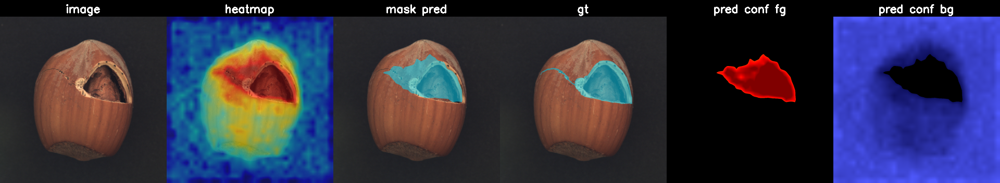 | 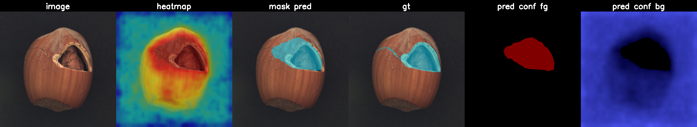 |
| crack 002 | 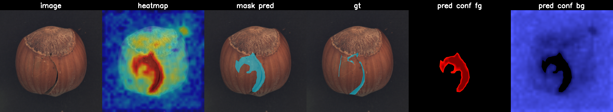 | 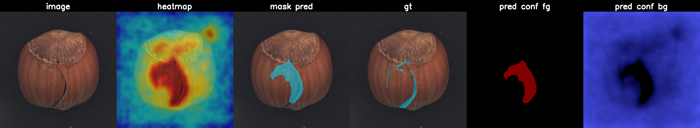 |
| hole 000  | 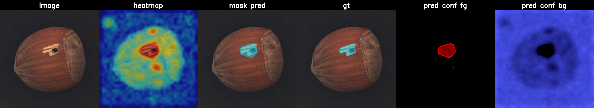  | 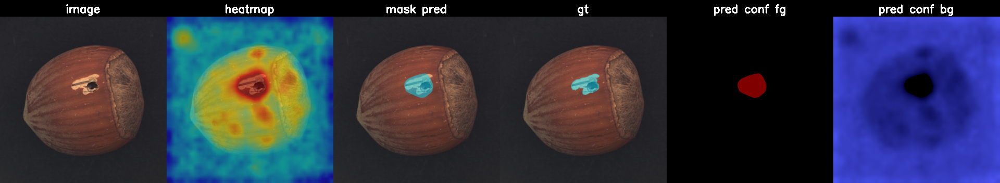 |

Kept in the toolbox for categories where no single scale dominates,
not as a default. The `--normalize {tp_max, zscore, none}` flag
controls how scales are made commensurate before averaging.

## Why the predicted mask is ~3x larger than GT

At F1-optimum, the predicted-mask area is ~3x the GT area even though
the mask is in the right place. The heatmap from a frozen-feature
model is fundamentally locally smoothed (3×3 patch aggregation +
bilinear upsample to image resolution), so the response spreads ~1-2
patch widths outward from the real defect. No threshold sweep removes
this. The **guided filter** in the recommended path narrows the gap
some (~0.027 IoU) by snapping the score map to image edges, but
doesn't close it.

Options for tighter mask outlines, with tradeoffs:

| Option | Effect on outline | Cost |
|---|---|---|
| Lower input scale (e.g. 224) | Coarser score map, *worse* overlap with thin defects | Loses F1 across the board |
| Higher input scale + smaller backbone patch | Finer score map | DINOv2 patch fixed at 14; already maxed for ViT-S/14 |
| Guided filter (current) | Snaps mask to image edges | +50 ms / image; already included in best config |
| Dense CRF post-process (`pydensecrf`) | Stronger edge-aware refinement | +300 ms / image; package install needed |
| Train a small UNet on (score map, image) → mask pairs | Genuine segmentation head | Needs ≥5-10 labelled defects (semi-supervised) |

For the current rotation-capture inspection intent (recall-first, DM
team verifies flagged regions), over-segmenting at ~3x is fine and
arguably preferable to a tight outline that misses the defect edge.

## Reference comparison: anomalib

To validate the numbers above against the canonical PatchCore
implementation, [scripts/run_anomalib.py](scripts/run_anomalib.py)
runs Intel's anomalib v1.2 PatchCore on the same MVTec splits.
The F1 numbers are in the [validated results table](#validated-results--mvtec-hazelnut-pixel-level-f1-vs-gt)
above; this section is what the masks look like side-by-side at the
same image.

```powershell
python scripts/run_anomalib.py --preset wrn50 `
    --data-root "E:\dataset\mvtec_anomaly_detection_" `
    --category hazelnut `
    --output outputs/anomalib_wrn50_hazelnut

python scripts/run_anomalib.py --preset dinov2 `
    --data-root "E:\dataset\mvtec_anomaly_detection_" `
    --category hazelnut --image-size 518 `
    --output outputs/anomalib_dinov2_hazelnut
```

`crack_000` mask overlay (same image, three implementations):

| Ours (Official + ViT-S/14 @ 518 + K=3 + GF) | anomalib (WRN-50, 224) | anomalib (DINOv2 ViT-S/14, 518) |
|---|---|---|
| 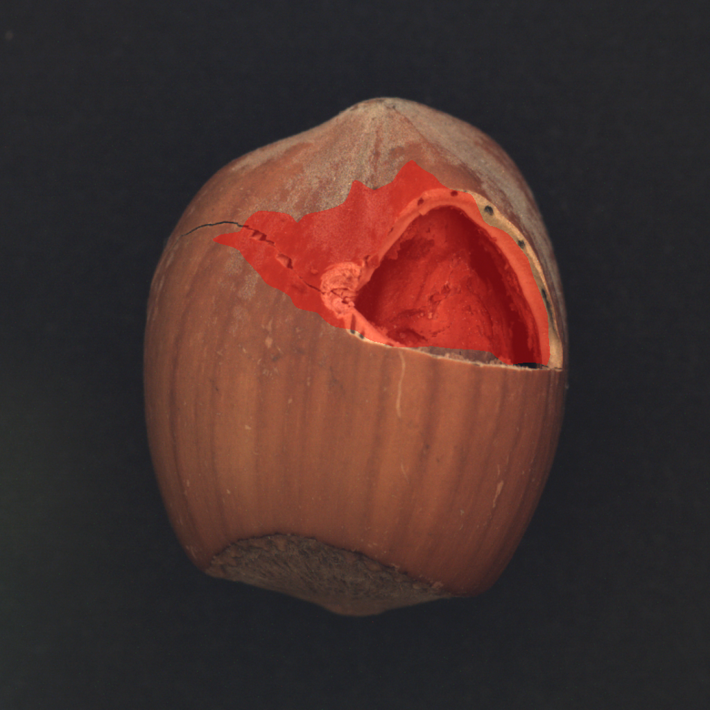 |  | 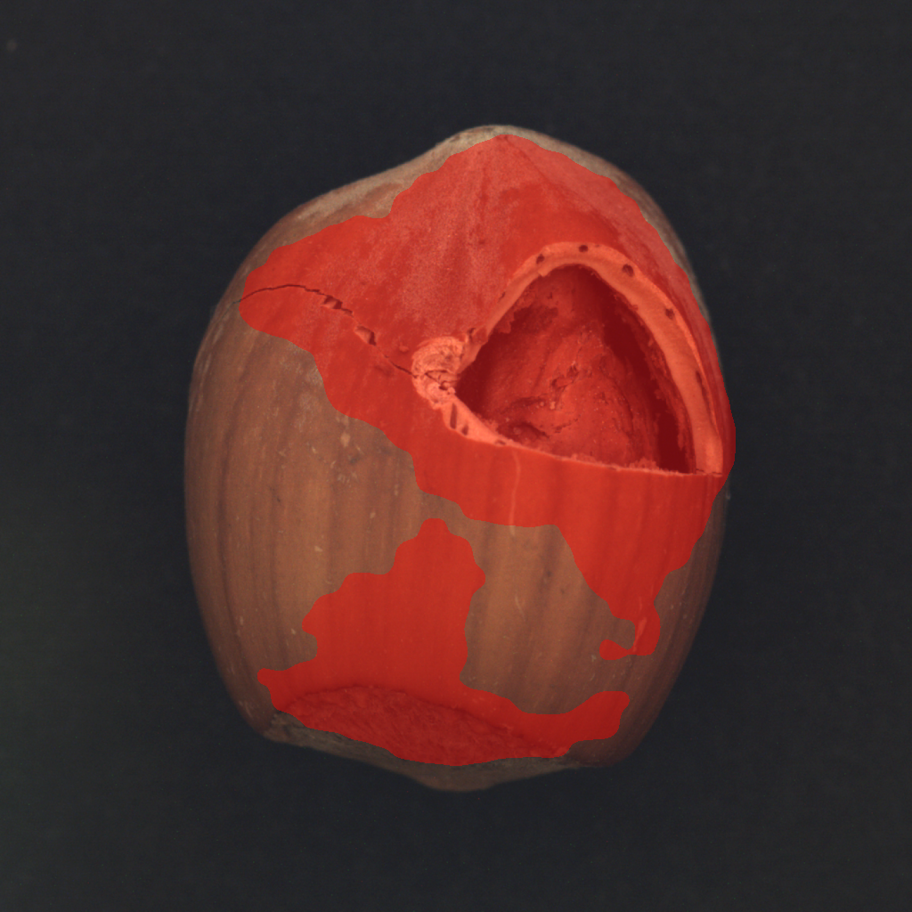 |

## Repo layout

```
configs/
  patchcore_official_dinov2_518.yaml   recommended: DINOv2 ViT-S/14 @ 518
  patchcore_official_dinov2.yaml       DINOv2 ViT-B/14 @ 224
  patchcore_official_wrn50.yaml        WideResNet-50 @ 224 (paper default)
  default.yaml, dinov2.yaml, hazelnut*.yaml   legacy configs (kept for archaeology)

scripts/
  run_patchcore_official.py    primary runner: train + inference + GT sweep
                               + panels + LabelMe JSON in one pass
  run_multiscale_ensemble.py   multi-scale variant (negative result on hazelnut)
  run_anomalib.py              anomalib v1.2 reference baseline
  evaluate_against_gt.py       standalone GT F1 / IoU sweep over a predictions dir
  smoke_check.py               synthetic-data sanity test (no MVTec needed)
  download_mvtec.py            fetch a single MVTec category
  compare_runs.py              merge sweep summaries into one markdown table
  sweep_thresholds.py          legacy: 8-config threshold sweep
  run_demo.ps1                 legacy end-to-end demo

src/
  data/dataset.py              MVTec dataset (with repeat for aug)
  data/transforms.py           train / test transforms
  models/patchcore_official.py paper-faithful PatchCore (FAISS + k-center)
  models/feature_extractor.py  backbone factory: ResNet hooks vs DINOv2 blocks
  models/patchcore.py          legacy non-FAISS variant
  utils/coreset.py             k-center greedy with random projection
  utils/postprocess.py         heatmap → mask → LabelMe JSON
  utils/visualize.py           calibrated heatmap normalize + overlays
  train.py, inference.py       legacy entry points (use run_patchcore_official.py)

docs/samples/
  patchcore_k3_gf/panel/       6-panel composites for the recommended path
  patchcore_official/panel/    6-panel composites for the K=1 baseline
  patchcore_multiscale/panel/  6-panel composites for the multi-scale ensemble
  anomalib_compare/            anomalib reference masks for comparison
  bottle_*.png                 fixed-pose bottle samples (separate pipeline)

outputs/<run>/                 every run's self-describing artifact dir
```

## Branching

`main` holds the validated baseline. Each experiment lives on a branch
off `dev` (e.g. `feat/threshold-calibration`, `exp/dinov2-backbone`)
and only merges back to `main` after validation.

```powershell
git checkout dev
git pull
git checkout -b feat/your-experiment
# ... iterate, commit ...
git push -u origin feat/your-experiment
# open PR: dev <- feat/your-experiment, then dev -> main
```

## License

Internal project. MVTec AD images are subject to MVTec's own license.
DINOv2 weights are released by Meta under their own terms; see
https://github.com/facebookresearch/dinov2.
