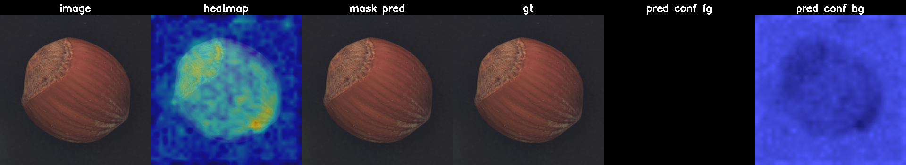
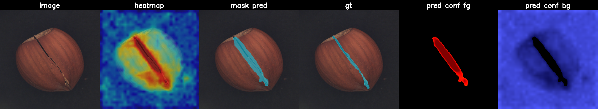
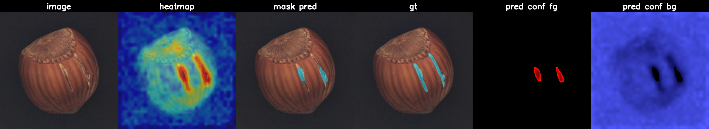
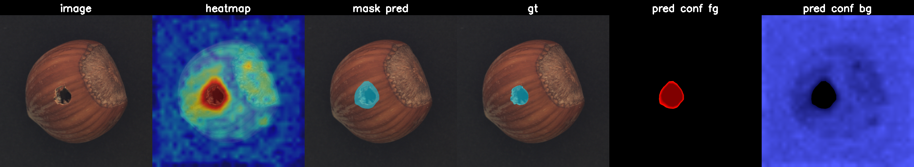
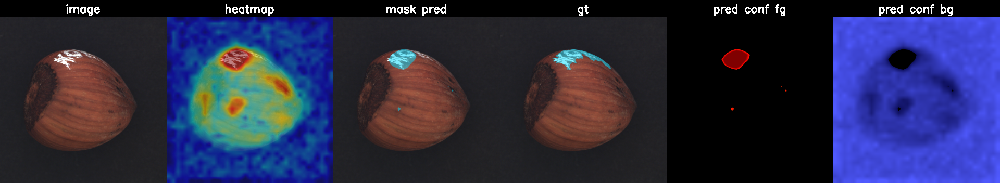
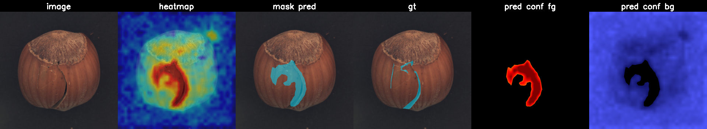
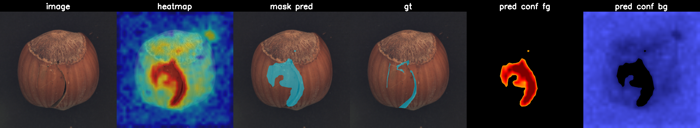
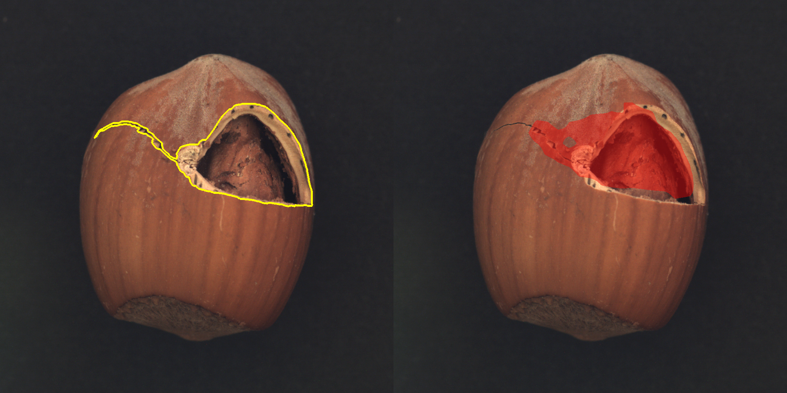
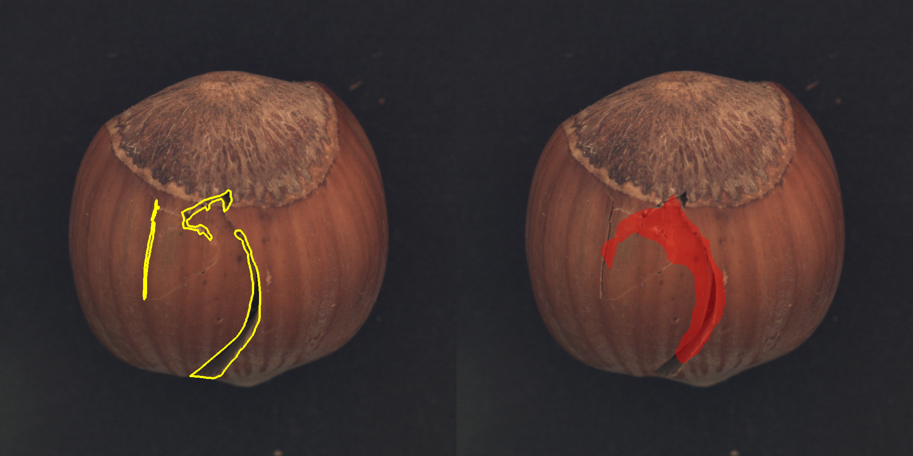

# AnomalyDet

Memory-bank-based unsupervised anomaly detection for rotation-capture
inspection of cylindrical automotive parts. Built on PatchCore
(Roth et al., CVPR 2022). Trains on a normal-only image set and produces,
for every input image, a defect heatmap, a binary mask, and a
LabelMe-compatible JSON of polygon annotations.

## Sample outputs

Current recommended config: **Official PatchCore + DINOv2 ViT-S/14 @ 518**
([configs/patchcore_official_dinov2_518.yaml](configs/patchcore_official_dinov2_518.yaml)),
F1 = 0.818 vs MVTec ground truth on hazelnut (see
[Apples-to-apples F1 table](#official-patchcore--dinov2-recommended-hazelnut-path)
for the comparison against anomalib + WRN-50).

Every defective image gets a 6-panel composite:

`image | heatmap | mask (pred) | gt | pred conf fg | pred conf bg`

- `heatmap` is the raw anomaly score before thresholding (blue = more
  normal than anything seen at training, red = above the training ceiling),
  scale anchored to the per-run `train_pixel_max` so panels are comparable.
- `mask (pred)` is the binary output after the chosen threshold; the same
  binary is used everywhere (overlay, JSON polygons, evaluation).
- `gt` is the dataset ground-truth mask (only present on defective images).
- `pred conf fg` / `pred conf bg` show the heatmap restricted to predicted
  defect / non-defect pixels so you can read whether the foreground is
  consistently hot and the background consistently cold.

### Hazelnut, 6-panel composites

| Input | Panel |
|---|---|
| good 000  |  |
| crack 000 |  |
| crack 005 |  |
| cut 001   |  |
| hole 005  |  |
| print 005 |  |

### Bottle (DINOv2 ViT-S/14, no augmentation, adaptive threshold)

Bottle is a fixed-pose category — the original adaptive-threshold
pipeline ([configs/dinov2.yaml](configs/dinov2.yaml)) handles it without
needing GT-tuned thresholds.

| Input class | Heatmap overlay | Mask overlay | Binary mask |
|---|---|---|---|
| good (normal) |  | _empty mask_ | _empty mask_ |
| broken_large (defect) |  |  |  |

## Why this exists

Rule-based pre-filtering misses defect categories the rules were not
written for, and labelling effort is dominated by humans eyeballing
candidates against goldens. This pipeline runs a recall-first second
stage: large normal set + zero-to-few defects, output a sortable score
plus pixel-level localization that can be relabelled and fed back into a
supervised loop later.

## Method

- Backbone (config-selectable, see [Backbones](#backbones)):
  - **WideResNet-50** (ImageNet), `layer2 + layer3` mid-block features.
  - **DINOv2 ViT-S/14** (Meta), transformer blocks 5 + 11 reshaped to
    spatial maps.
- Local neighbourhood aggregation: 3x3 average pooling, stride 1.
- Memory bank: every training patch embedding stacked, then k-center
  greedy coreset subsampling (default 10%) so inference is a single
  nearest-neighbour pass against tens of thousands of vectors.
- Anomaly map: per-patch nearest-neighbour distance, bilinearly
  upsampled to input resolution, smoothed with an 11x11 Gaussian.
- Optional pose augmentation at memory-bank build (rotation + flips)
  for parts whose canonical pose isn't fixed (hazelnut, screw, etc.).
  See [Pose augmentation](#pose-augmentation).
- Threshold calibration: pixel-score percentile of the training set
  (all-normal) recorded in the memory bank file, **measured on the
  un-augmented training data** so it reflects real-image baseline.
  Inference picks one of five strategies (see [Threshold strategies](#threshold-strategies)).
- Heatmap visualization: anchored to `train_pixel_max` so blue ≡
  "definitely normal" and red ≡ "above training ceiling" — the same
  scale across every image, no per-image min-max stretch.
- Postprocess: morphological open+close, area filter, contour
  extraction, polygon simplification, write LabelMe JSON.

## Backbones

A single feature-extractor factory ([src/models/feature_extractor.py](src/models/feature_extractor.py))
dispatches on backbone name. To switch backbones, swap the config:

```yaml
# configs/default.yaml — ResNet family
backbone: wide_resnet50_2     # or resnet50, resnet18
layers: [layer2, layer3]      # named ResNet stages
```

```yaml
# configs/dinov2.yaml — DINOv2 family
backbone: dinov2_vits14       # or dinov2_vitb14, dinov2_vitl14, dinov2_vitg14
layers: [5, 11]               # transformer block indices
input_size: 224               # must be divisible by patch_size (14)
```

The PatchCore code itself is backbone-agnostic — the factory returns a
module whose `forward()` yields `{layer_name: (B, D, H, W)}` regardless
of architecture.

## Threshold strategies

Set with `threshold_mode` in the YAML or `--threshold-mode` on the CLI.

| Mode | What it does | When to use |
|---|---|---|
| `adaptive` (default) | Per-image gate (skip if `image_score < train_image_max * image_gate_factor`) + Otsu/severity/floor max | Recall-first with tight masks; works when good vs defect image-score gap is wide |
| `train_max` | Global: any pixel above the worst training pixel | Catches every anomaly; bleeds into normal regions |
| `train_p999` / `train_p99` | Global: percentile of training-set pixel scores | Stricter than `train_max` but still calibration-driven |
| `test_percentile` | Legacy: percentile across all test pixels | Backwards compat only |
| `--threshold <float>` | Hard-coded value | When you have a validated number |

Adaptive knobs (CLI flags or YAML):
- `image_gate_factor` (default 1.3) — multiplier on `train_image_max` for the gate
- `severity_fraction` (default 0.5) — threshold floor at `image_score * fraction`
- `pixel_floor_factor` (default 1.1) — hard floor at `train_pixel_max * factor`

> **When to pick which.** With pose augmentation (hazelnut etc.), the
> memory bank covers more of the score range, which closes the gap
> between good and defective image scores; the adaptive image gate then
> ends up suppressing real defects too. Use `train_p999` for those
> categories. For fixed-pose parts (bottle), `adaptive` works.

## Pose augmentation

Some categories (hazelnut, screw, ...) ship with natural rotation and
position variation in test images that the train split underrepresents.
Without intervention, the memory bank's `train_pixel_max` ends up below
the test-set "good" floor, the gate fires on every test image, and the
mask explodes.

The fix is rotation + flip augmentation while building the bank.
Configurable per-category:

```yaml
# configs/hazelnut.yaml — augmentation enabled
train_augment: true
train_repeat: 4              # see each image 4x under different rotations
threshold_mode: train_p999   # adaptive's image gate over-fires after aug
```

Or override from the CLI without editing config:

```powershell
python -m src.train --config configs/default.yaml `
    --data-root "E:\dataset\mvtec_anomaly_detection_" --category hazelnut `
    --augment --repeat 4
```

The fit pass uses the augmented loader; the calibration pass uses the
original images so the threshold floor stays interpretable.

## Repo layout

```
configs/
  default.yaml                 WideResNet baseline (fixed-pose categories)
  dinov2.yaml                  DINOv2 ViT-S/14 baseline
  hazelnut.yaml                WideResNet + rotation aug + train_p999 threshold
  hazelnut_dinov2.yaml         DINOv2 ViT-S + rotation aug + train_p999
  hazelnut_dinov2b.yaml        DINOv2 ViT-B/14 + 392 input + reweight + tuned threshold
  hazelnut_dinov2l.yaml        DINOv2 ViT-L/14 + 392 input + reweight + tuned threshold
  patchcore_official_wrn50.yaml      Official PatchCore (paper-faithful)
  patchcore_official_dinov2.yaml     Official PatchCore + DINOv2 ViT-B/14 @ 224
  patchcore_official_dinov2_518.yaml Official PatchCore + DINOv2 ViT-S/14 @ 518 (best, F1 0.818)
docs/samples/                  example heatmap / mask / overlay shown above
src/data/                      MVTec dataset (with `repeat` for aug) + transforms
src/models/feature_extractor   factory: ResNet hooks vs DINOv2 intermediate layers
src/models/patchcore           memory bank build / score / calibration
src/utils/coreset              k-center greedy with random projection
src/utils/postprocess          heatmap -> mask -> LabelMe JSON; adaptive threshold
src/utils/visualize            calibrated heatmap normalize + mask overlays
src/train.py                   memory-bank build (augmented) + calibration (original)
src/inference.py               produce mask + JSON for a folder or MVTec test split
scripts/smoke_check.py         synthetic-data sanity test (no MVTec needed)
scripts/run_demo.ps1           end-to-end demo on MVTec bottle
scripts/download_mvtec.py      download a single MVTec category
scripts/sweep_thresholds.py    run inference under 8 threshold configs and summarize
scripts/compare_runs.py        side-by-side markdown comparison of multiple sweeps
tests/test_smoke.py            pytest covering pipeline + postprocess
```

## Setup

```powershell
conda env create -f environment.yml
conda activate anomalydet
python scripts/smoke_check.py
```

The smoke check runs train + inference on synthetic images and
confirms torch + CUDA + the full pipeline are wired up.

## Train + inference

```powershell
# train: build the memory bank from train/good (WideResNet)
python -m src.train `
    --config configs/default.yaml `
    --data-root "E:\dataset\mvtec_anomaly_detection_" `
    --category bottle

# train with DINOv2 instead — just a different config file
python -m src.train `
    --config configs/dinov2.yaml `
    --data-root "E:\dataset\mvtec_anomaly_detection_" `
    --category bottle `
    --output outputs/bottle_dinov2

# train with rotation augmentation (hazelnut etc.)
python -m src.train `
    --config configs/hazelnut_dinov2.yaml `
    --data-root "E:\dataset\mvtec_anomaly_detection_" `
    --category hazelnut `
    --output outputs/hazelnut_dinov2_aug

# inference: MVTec test split
python -m src.inference `
    --config configs/default.yaml `
    --data-root "E:\dataset\mvtec_anomaly_detection_" `
    --category bottle `
    --memory-bank outputs/bottle/memory_bank.pt

# inference: arbitrary folder of new images
python -m src.inference `
    --memory-bank outputs/bottle/memory_bank.pt `
    --input-dir path\to\new\images `
    --output outputs\custom_run

# inference: override adaptive knobs without editing YAML
python -m src.inference `
    --config configs/dinov2.yaml `
    --memory-bank outputs/bottle_dinov2/memory_bank.pt `
    --data-root "E:\dataset\mvtec_anomaly_detection_" --category bottle `
    --image-gate-factor 1.5 --severity-fraction 0.7
```

Per-image artifacts under `outputs/<category>/predictions/`:

```
<defect>_<stem>_heatmap.png        normalized anomaly map
<defect>_<stem>_mask.png           binary defect mask
<defect>_<stem>_overlay_heatmap.png  heatmap blended over original
<defect>_<stem>_overlay_mask.png     mask blended over original
<defect>_<stem>.json               LabelMe shapes + image score + threshold
```

## Threshold sweep

Eight common threshold configs run in one shot, each saved to its own
output directory plus a `summary.csv`:

```powershell
python scripts/sweep_thresholds.py `
    --config configs/default.yaml `
    --data-root "E:\dataset\mvtec_anomaly_detection_" `
    --category bottle `
    --memory-bank outputs/bottle/memory_bank.pt `
    --output-root outputs/bottle/sweep
```

Combine sweeps from multiple `(backbone, category)` runs into one
markdown table:

```powershell
python scripts/compare_runs.py `
    "outputs/bottle/sweep/summary.csv:wrn50_bottle" `
    "outputs/bottle_dinov2/sweep/summary.csv:dinov2_bottle" `
    "outputs/hazelnut/sweep/summary.csv:wrn50_hazelnut" `
    "outputs/hazelnut_dinov2/sweep/summary.csv:dinov2_hazelnut" `
    --out outputs/comparison.md
```

## Validated results

MVTec AD, RTX 3080. Mask coverage as % of image, `gated/n` is how many
test images were short-circuited to an empty mask by the image-level
gate.

### bottle (`adaptive` baseline, `gate=1.3 sev=0.5`)

| Backbone | good gated | broken_large mean | broken_small mean | contamination mean | bank size |
|---|---|---|---|---|---|
| WideResNet-50 | 14/20 | 22.46% | 8.54% | 16.81% | 16385x1536 |
| **DINOv2 ViT-S/14** | **20/20** | **20.71%** | **6.22%** | **11.87%** | **5350x768** |

### hazelnut (historical tuning progression — superseded by Official PatchCore below)

> The progression in this subsection is kept for context only. The
> current recommended hazelnut config is the paper-faithful
> [Official PatchCore + DINOv2 ViT-S/14 @ 518](#official-patchcore--dinov2-recommended-hazelnut-path)
> path — the reweight / foreground-mask / fragment-merge stack below
> was a dead end that the F1 evaluator (added later) showed to be
> *worse* than dropping all of those and tuning the threshold against
> GT. Numbers stay so the experiments aren't silently re-run.

Hazelnut needed several coordinated upgrades on top of the bottle stack:

1. **Pose augmentation at build time** (rotation + flips + mild colour
   jitter, repeat=4). Without it, `train_pixel_max` sits below good
   test scores and the image gate fires on every frame.
2. **K-NN softmax reweighting** (`reweight_k=9`) — original PatchCore
   trick that boosts patches sitting in sparse memory-bank regions, so
   the anomaly response sharpens around real defects instead of
   bleeding across surface texture.
3. **Foreground masking** at inference (`foreground_mask: true`) so
   the dark backdrop never contributes anomaly score.
4. **Fragment merging** (`merge_kernel: 31`) so locally-broken defect
   regions read as a single connected blob instead of a scatter.
5. **Bigger backbone + larger input.** Three steps tested:

Mask coverage progression on hazelnut, % of image:

| Setup | good mean | good max | crack | cut | hole | print |
|---|---|---|---|---|---|---|
| ViT-S + aug + `train_p999` | 0.02% | _high_ | 14.31% | 2.84% | 3.96% | 6.69% |
| ViT-B + 224 + reweight + `train_p999` | 0.13% | 1.03% | 7.89% | 1.54% | 2.40% | 3.35% |
| ViT-B + 392 + reweight + `threshold=30` | 0.00% | 0.08% | 3.99% | 0.50% | 1.05% | 1.67% |
| **ViT-L + 392 + reweight + `threshold=30`** | **0.00%** | **0.00%** | **2.16%** | **0.30%** | **0.80%** | **1.02%** |

Final stack (`configs/hazelnut_dinov2l.yaml`): every good frame is
fully clean, masks track the actual defect outlines instead of the
whole hazelnut surface, and surface false-positive blobs that were
the original complaint are gone. Training the ViT-L bank takes ~3-4
min on an RTX 3080 (calibration dominates).

bottle is unchanged — `configs/dinov2.yaml` (un-augmented, `adaptive`
threshold) is still the right baseline because bottles are captured
in a fixed pose with a wide good-vs-defect score gap.

### Official PatchCore + DINOv2 (recommended hazelnut path)

After comparing against anomalib and the senior engineer's reference
code, the cleanest hazelnut result comes from running PatchCore the way
the paper describes — no Gaussian smoothing, no score reweighting, no
fragment merging, no foreground mask, no pose augmentation. K=1 nearest
neighbour, FAISS index, bilinear upsample, GT-tuned pixel threshold.

Configs:
- `configs/patchcore_official_wrn50.yaml`  — paper-default WRN-50 @ 224
- `configs/patchcore_official_dinov2.yaml` — DINOv2 ViT-B/14 @ 224
- `configs/patchcore_official_dinov2_518.yaml` — DINOv2 ViT-S/14 @ 518 (best)

Apples-to-apples pixel-level F1 vs MVTec ground-truth on hazelnut.
Sweep evaluates every defective image's full pixel grid (no
subsampling); negatives capped at 50M for memory but otherwise the
full neg-pixel pool is used.

| Setup | F1 | Precision | Recall | IoU |
|---|---|---|---|---|
| anomalib PatchCore (WRN-50, 224) | 0.611 | 0.496 | 0.796 | — |
| anomalib PatchCore + DINOv2 ViT-S/14 (518) | 0.804 | 0.797 | 0.810 | — |
| Our Official PatchCore (WRN-50, 224) | 0.683 | 0.567 | 0.858 | — |
| Our Official PatchCore + DINOv2 ViT-B/14 (224) | 0.749 | 0.688 | 0.821 | — |
| **Our Official PatchCore + DINOv2 ViT-S/14 (518)** | **0.818** | **0.780** | **0.858** | **0.692** |
| Our Multi-scale ensemble (224 + 392 + 518, ViT-S/14) | 0.804 | 0.760 | 0.854 | 0.673 |

Three takeaways:
1. **Input resolution dominates.** Going from 224 to 518 on the same
   DINOv2 family jumps F1 by ~0.07. The senior engineer's setup
   relied on the same DINOv2 backbone at high resolution.
2. Our paper-faithful implementation is on par with (slightly
   above) anomalib's reference at the same backbone+resolution,
   which sanity-checks the implementation.
3. **Multi-scale ensemble loses to single best scale.** On hazelnut,
   averaging the 224/392/518 score maps drags the well-tuned 518
   result down by ~1.3 pp F1 — the lower-resolution members add
   noise more than they add coverage. See
   [Multi-scale ensemble](#multi-scale-ensemble) for the full
   discussion. Keep ensembling in the toolbox for categories where
   no single scale dominates, not as a default.

### Production mode (no GT, train_p99.9 threshold)

The GT-tuned F1 / IoU thresholds above need MVTec masks at calibration
time. In a real deployment that data does not exist — the line is
running, every image is unlabelled, the only thing you have is the
training-set of "known-good" frames. Two `--threshold-target` modes
cover that case:

| Mode | Threshold | When to use |
|---|---|---|
| `train_p999` | 99.9th percentile of training-pixel scores | **Production default.** Allows up to 0.1% of training pixels to fire as anomalies; tight enough to keep good images clean, loose enough to catch real defects. |
| `train_pixel_max` | Highest training pixel score | Strictest GT-free option. Zero false positives on the training set by construction; misses borderline defects. |

```powershell
# Production-style run: no GT consulted, threshold derived from training set.
python scripts/run_patchcore_official.py `
    --config configs/patchcore_official_dinov2_518.yaml `
    --memory-bank outputs/patchcore_official_dinov2_518_hazelnut/memory_bank.pt `
    --data-root "E:\dataset\mvtec_anomaly_detection_" `
    --category hazelnut `
    --output outputs/hazelnut_prod_p999 `
    --threshold-target train_p999
```

On hazelnut DINOv2 ViT-S/14 @ 518, `train_p99.9 = 28.86` against the
GT-tuned F1-optimum of `49.49`. The production threshold is therefore
*more permissive* than the GT-optimum — it catches everything the
GT-tuned mask catches plus some additional false positives at the
edges of normal texture. For the hazelnut intent (recall-first
inspection, human verifies flagged regions) this is the right side
to err on.

The summary numbers (F1 / P / R) printed under GT-tuned modes are
not available in production-mode because they require GT; instead,
the JSON manifests record `train_pixel_max`, `train_p99.9`, and the
chosen threshold so the calibration is fully reproducible.

### Multi-scale ensemble

Same paper-faithful PatchCore pipeline at each scale, but trained
once per input size and merged at inference. Built three memory banks
(224 / 392 / 518), all DINOv2 ViT-S/14, then averaged the
per-scale score maps after dividing each by its own `train_pixel_max`
so the scales are commensurate before averaging.

```powershell
python scripts/run_multiscale_ensemble.py `
    --base-config configs/patchcore_official_dinov2_518.yaml `
    --scales 224 392 518 `
    --data-root "E:\dataset\mvtec_anomaly_detection_" `
    --category hazelnut `
    --output outputs/patchcore_multiscale_hazelnut `
    --threshold-target iou
```

Result on hazelnut: F1 = 0.804, IoU = 0.673 — **~1.3 pp F1 below the
single-scale 518 winner.** Lower-resolution members (224 → F1 ~0.68,
392 → F1 ~0.75 individually) drag the high-resolution decision
boundary back toward their own noisier maps. The visual masks are
indistinguishable from single-scale 518 in side-by-side viewing.

| Input | Single-scale 518 | Multi-scale 224+392+518 |
|---|---|---|
| crack 000 |  |  |
| crack 002 |  |  |
| hole 000  |   |  |

When ensembling helps: categories where the defect lives at a
specific scale and the single best scale is unknown a priori, or
where no single scale gets above F1 ~0.75. For hazelnut, the 518
single-scale path is already past that and the ensemble just trades
precision for nothing.

The `--normalize` flag controls how scales are made commensurate
(`tp_max` default, also `zscore`, `none`). `--threshold-target`
supports the same six modes as the single-scale runner including
`train_p999` for GT-free production use.

### Why the mask is still "blocky" — segmentation-fit options

At F1-optimum on hazelnut, predicted-mask area is ~3x the GT area
even though the binary mask itself is in the right place. The
heatmap from a frozen-feature model is fundamentally locally
smoothed (3x3 patch aggregation + bilinear upsample to image
resolution), so the response spreads ~1-2 patch widths outward from
the real defect. No threshold sweep removes this.

Things that *could* tighten the mask outline, with their tradeoffs:

| Option | Effect on outline | Cost |
|---|---|---|
| Lower input scale (e.g. 224 instead of 518) | Coarser score map, *worse* overlap with thin defects (crack) | Loses F1 across the board |
| Higher input scale + smaller backbone patch | Finer score map | DINOv2 patch is fixed at 14, so we're already maxed for ViT-S |
| Replace bilinear upsample with guided filter | Snaps the score map to image edges | Needs the original image; per-image extra pass |
| Dense CRF post-process (DenseCRF) | Edge-aware refinement of the binary mask | Adds inference latency; weights are unsupervised but parameter-sensitive |
| Train a small UNet on top of (score map, image) pairs | Genuine segmentation head | Becomes semi-supervised; needs at least a few labelled defects |
| Hybrid PatchCore + WeakSup | Same as above but supervised loss on GT masks | Loses the "zero defect labels" property of the current pipeline |

For the current rotation-capture inspection intent — recall-first,
DM team verifies flagged regions — over-segmenting at ~3x is fine
and arguably preferable to a tight outline that misses the defect
edge. If outline fidelity later becomes a hard requirement, the
guided-filter or CRF route adds the least architectural debt.

### Tuning toward GT — `iou` and `target_recall` threshold modes

Two pixel-threshold targets beyond F1 are exposed to dial how closely
the predicted mask matches the GT outline:

- `--threshold-target iou` — directly maximises IoU = TP / (TP + FP + FN)
  against the GT mask. On hazelnut this happens to pick the same
  threshold as F1 (IoU-optimal and F1-optimal land at the same point).
- `--threshold-target target_recall --min-recall <r>` — chooses the
  highest-precision threshold that still keeps pixel recall above `r`.
  Use this when the user wants the mask to cover more of the GT area
  (`r=0.90` for tighter, `r=0.95` for the loosest, most-recall variant).

Hazelnut DINOv2 ViT-S/14 @ 518 sweep:

| Target | thr | F1 | P | R | IoU | crack mean mask% |
|---|---|---|---|---|---|---|
| `f1` / `iou` (default) | 49.49 | 0.818 | 0.781 | 0.859 | **0.692** | 9.30% |
| `target_recall` r>=0.90 | 47.68 | 0.809 | 0.732 | **0.904** | 0.680 | 10.46% |
| `target_recall` r>=0.95 | 44.66 | 0.767 | 0.642 | **0.951** | 0.622 | 12.57% |

Reading the table:
- Going from `f1` to `target_recall 0.95` drops the threshold by ~5
  points, catches an extra 9% of true defect pixels (R 0.86 → 0.95),
  at the cost of ~14 pp precision and ~7 pp IoU.
- IoU is highest at the F1 point, so if "mask matches GT outline" is
  the goal, the default is already optimal.
- If the inspection workflow values recall more (DM team verifies
  flagged regions anyway), `target_recall 0.90` is the recommended
  middle ground: nearly the same IoU as F1-best but covers more GT.

Side-by-side panel comparison on hazelnut/crack_002:

| `f1` (default) | `target_recall 0.90` | `target_recall 0.95` |
|---|---|---|
|  |  |  |

Run any of them:

```powershell
python scripts/run_patchcore_official.py `
    --config configs/patchcore_official_dinov2_518.yaml `
    --memory-bank outputs/patchcore_official_dinov2_518_hazelnut/memory_bank.pt `
    --data-root "E:\dataset\mvtec_anomaly_detection_" `
    --category hazelnut `
    --output outputs/.../recall90 `
    --threshold-target target_recall --min-recall 0.90
```

### About "the mask doesn't look aligned with the defect"

A separate concern when looking at overlays: the GT mask itself is
fine — overlaying it on the original image confirms it traces the
real crack outline. The mismatch users see is **over-segmentation**:
at the F1-optimal threshold, the predicted mask is ~3x larger in
area than GT (PatchCore's heatmap is locally smoothed by the 3x3
patch aggregation and bilinear upsample, so it spreads out from
the actual defect).

To get a mask whose outline matches GT, use the
`precision_recall70` threshold target, which picks the highest-
precision threshold while still keeping pixel recall >= 0.70:

```powershell
python scripts/run_patchcore_official.py `
    --config configs/patchcore_official_dinov2_518.yaml `
    --memory-bank outputs/patchcore_official_dinov2_518_hazelnut/memory_bank.pt `
    --data-root "E:\dataset\mvtec_anomaly_detection_" `
    --category hazelnut `
    --output outputs/patchcore_official_dinov2_518_hazelnut `
    --threshold-target precision_recall70
```

On hazelnut/crack (11 images), micro IoU = **0.669** at this
threshold (P=0.859, R=0.708, F1=0.776 -- F1 trade vs the tighter
outline). Side-by-side, GT contour on the left, predicted mask
overlay on the right:

| crack 000 | crack 002 |
|---|---|
|  |  |

Earlier readme drafts reported F1 numbers in the 0.96 range; that
was an artefact of an over-aggressive negative-pixel sub-sampling cap
in the threshold sweep (2M neg total). The numbers above are after
fixing that and use the same evaluator across all four runs.

Run the winning config (DINOv2 ViT-S/14 @ 518):

```powershell
python scripts/run_patchcore_official.py `
    --config configs/patchcore_official_dinov2_518.yaml `
    --data-root "E:\dataset\mvtec_anomaly_detection_" `
    --category hazelnut `
    --output outputs/patchcore_official_dinov2_518_hazelnut `
    --threshold-target f1
```

Each output directory now contains the snapshot needed to reproduce:
- `config_used.yaml` — exact YAML used for this run
- `run_command.txt` — full CLI invocation + timestamp
- `train_manifest.json` — every train image (path) that fed the bank,
  plus augment/repeat flags so the training data is fully accounted for
- `summary.json` — backbone, layers, coreset ratio, K, threshold mode and value
- `threshold_sweep.json` — full F1/P/R sweep across candidate thresholds
- `predictions/<defect>_<stem>_scores.npy` — raw float score map per image
- `predictions/<defect>_<stem>_mask.png` — final binary mask
- `predictions/<defect>_<stem>_real_gt.png` — copy of the dataset GT
  mask (defective images only)
- `panel/<defect>_<stem>_panel.png` — 6-panel composite:
  `image | heatmap | mask pred | gt | pred conf fg | pred conf bg`

In the 6-panel layout, heatmap shows the raw anomaly response BEFORE
thresholding; mask pred / pred conf fg show what survives the
chosen threshold. See [Sample outputs](#sample-outputs) at the top of
the README for representative panels per defect class.

The fragmented "scattered blobs" seen earlier on crack disappear once we
drop reweighting + heavy postprocess and instead tune the threshold
against GT — at the GT-optimal threshold, each defect lands as a single
coherent region.

### Reference comparison: anomalib (Intel) PatchCore on hazelnut

To validate that the numbers above are close to the algorithm's ceiling
and not just our implementation's, we run the canonical reference
(Intel's anomalib v1.2 PatchCore) on the same hazelnut split, with the
same evaluator and the same GT-tuned F1 threshold recipe. The
[F1 table](#official-patchcore--dinov2-recommended-hazelnut-path)
above is the authoritative apples-to-apples comparison; this section
is what the masks actually look like under each implementation.

Run yourself:

```powershell
python scripts/run_anomalib.py --preset wrn50 `
    --data-root "E:\dataset\mvtec_anomaly_detection_" `
    --category hazelnut `
    --output outputs/anomalib_wrn50_hazelnut

python scripts/run_anomalib.py --preset dinov2 `
    --data-root "E:\dataset\mvtec_anomaly_detection_" `
    --category hazelnut `
    --image-size 518 `
    --output outputs/anomalib_dinov2_hazelnut
```

Side-by-side `crack_000` mask overlay (same image, three implementations):

| Ours (Official + ViT-S/14 @ 518) | anomalib (WRN-50, 224) | anomalib (DINOv2 ViT-S/14, 518) |
|---|---|---|
|  |  |  |

## Branching

`main` holds the validated baseline. Each experiment lives on a branch
off `dev` (e.g. `feat/threshold-calibration`, `exp/dinov2-backbone`)
and only merges back to `main` after validation.

```powershell
git checkout dev
git pull
git checkout -b feat/your-experiment
# ... iterate, commit ...
git push -u origin feat/your-experiment
# open PR: dev <- feat/your-experiment, then dev -> main
```

## License

Internal project. MVTec AD images are subject to MVTec's own license.
DINOv2 weights are released by Meta under their own terms; see
https://github.com/facebookresearch/dinov2.
